# SPECS Fluorescence Prediction

This is an example notebook demonstrating how SPECS sequencing and FACS data can be used to generate a predictive model and identify cell state specific promoters.

### Dependencies

```r
suppressMessages(library(flowCore))
suppressMessages(library(caret))

suppressMessages(library(cowplot))

suppressMessages(library(doMC))
registerDoMC(cores=6)

suppressMessages(library(reshape2))
suppressMessages(library(data.table))
suppressMessages(library(tidyverse))

options(warn = -1)
knitr::opts_chunk$set(dev=c('svg', 'png'), dpi=150, fig.width=5, fig.height=4)
```

## FACS data processing
In order to generate a predictive model of fluorescence, 64 promoters were manually cloned according to a heuristic for fluorescence (average bin fluorescence weighted by bin counts, see materials and methods).
This together with 17 unique promoters from the random top 5% approach yields 81 promoters available as training and validation data.


```r
read_prom <- function(sample_num, col_data, folder)
{
  #Gathers nessecary metadata 
  i <- which(col_data$sample==sample_num)
  plasmid_name <- col_data$Plasmid[i]
  cell_line <- col_data$cell_line[i]
  class_1 <- col_data$Class[i]
  consensus <- col_data$consensus[i]
  
  # Read FCS files
  sample_num <- paste(paste(rep("0", 2 - floor(log10(sample_num))),collapse =""),sample_num,sep = "") #matching zero padded file name
  path <- paste(folder,"Tube_",sample_num,".fcs",sep = "")
  prom <-read.FCS(path, alter.names = TRUE)
  
  # Read red channel
  prom <- as.data.frame(exprs(prom)) %>% select(PE.Texas.Red.A)
  prom <- prom[order(prom$PE.Texas.Red.A),] %>% as.data.frame()
  colnames(prom) <- plasmid_name
  
  #convert to long format and retain importent meta data
  tmp <-melt(prom)
  tmp$cell_line <- cell_line
  tmp$class_1 <- class_1
  tmp$consensus <- consensus
  return(tmp)
}

# All the 64 pretested promoters are read and processed
col_data <- fread("raw_TRAIN_data/col_data.txt")
proms <- read_prom(col_data$sample[1], col_data, "raw_TRAIN_data/")
for (i in 2:nrow(col_data))
{
  proms <- rbind(proms, read_prom(col_data$sample[i], col_data,"raw_TRAIN_data/"))
}

# The same is performed for the 17 random top5% approach promoters
col_data_t5r <- fread("raw_TOP5_data/col_data.txt")
for (i in 1:nrow(col_data_t5r))
{
  proms <- rbind(proms, read_prom(col_data_t5r$sample[i], col_data_t5r,"raw_TOP5_data/"))
}

# process
proms <- filter(proms, !(class_1 %in% c("pos_control","neg_control","MDA Spec. (validated)"))) # not used in the prediction
proms <- proms %>% 
  group_by(consensus,cell_line,variable, class_1) %>% #calculating the median
  summarise(m=median(value)) %>% 
  ungroup() 
setnames(proms, "variable", "Plasmid")

# A similar process can be used on the validation data:----
#load("act_countmat_norm.RData")
col_data_valid <- read.delim("raw_VALID_data/col_data.txt", header = T, stringsAsFactors = F) %>% filter(consensus!="")

folder = paste("raw_VALID_data/",col_data_valid$cell_line[1],"/",sep="")
proms_VALID <- read_prom(col_data_valid$sample[1], filter(col_data_valid,cell_line==col_data_valid$cell_line[1]) ,folder)
for (i in 2:nrow(col_data_valid))
{
  folder = paste("raw_VALID_data/",col_data_valid$cell_line[i],"/",sep="")
  tmp <- read_prom(col_data_valid$sample[i], filter(col_data_valid,cell_line==col_data_valid$cell_line[i]),folder)
  proms_VALID <- rbind(proms_VALID, tmp)
}

proms_VALID <- proms_VALID %>% 
  group_by(consensus,cell_line,variable, class_1) %>%
  summarise(m=median(value)) %>%
  ungroup()

setnames(proms_VALID, "variable", "Plasmid")


# The output is saved as a CSV file
fwrite(proms, "promoters_TRAIN_FACS.csv")
fwrite(proms_VALID, "promoters_VALID_FACS.csv")
```

## Counts data
Counts data were preprocessed as described in the preprocessing pipeline and normalized using DESeq2 size factors.
This processing performs log2 transformation and add the target variable (i.e. median fluorescence) to the data to ready for generating models.

```r
proms_train <- fread("promoters_TRAIN_FACS.csv")
proms_VALID <- fread("promoters_VALID_FACS.csv")

#prepare counts
col_data_counts <- read.table("coldata_counts.txt", header = T, stringsAsFactors = F)
counts_mat <- read.table("counts_D5.norm.DESEQ.filtered.txt", stringsAsFactors = F) %>% melt(., id.vars=c("consensus"))
counts_mat$variable <- gsub("X","", counts_mat$variable)

# tidy metadata
counts_mat <- col_data_counts %>% select(cell_line, bio._rep., tech._rep., bin, name) %>% left_join(counts_mat, ., by=c("variable"="name"))
counts_mat <- filter(counts_mat, bin!="unsort")
counts_mat$bin <- factor(counts_mat$bin, levels = c("neg","low","high","top10_5","top5"))
counts_mat$variable <- NULL
setnames(counts_mat, "value", "counts")

#filter promoters in training data by sequence
counts_mat_train <- counts_mat %>% filter(consensus %in% proms_train$consensus)
counts_mat_val <- counts_mat %>% filter(consensus %in% proms_VALID$consensus)

#add target - i.e. median fluorescence, to the data
dat <- left_join(counts_mat_train, proms_train, by=c("consensus", "cell_line"))
val <- left_join(counts_mat_val, proms_VALID, by=c("consensus", "cell_line"))

#log2 of counts and median fluorescence
dat$counts <- log2(dat$counts+1)
dat$m <- log2(dat$m+1)

val$counts <- log2(val$counts+1)
val$m <- log2(val$m+1)

#tidy data
setnames(dat, c("counts","m"), c("log2_counts","log2_median_fluorescence"))
setnames(val, c("counts","m"), c("log2_counts","log2_median_fluorescence"))

dat$bio._rep. <- factor(dat$bio._rep.)
dat$bin <- factor(dat$bin, levels=c("neg","low","high","top10_5","top5"))

val$bio._rep. <- factor(val$bio._rep.)
val$bin <- factor(val$bin, levels=c("neg","low","high","top10_5","top5"))

#cast to wide format
dat <- dcast(dat, consensus+Plasmid+log2_median_fluorescence+cell_line~bio._rep.+tech._rep.+bin, value.var="log2_counts")
val <- dcast(val, consensus+Plasmid+log2_median_fluorescence+cell_line~bio._rep.+tech._rep.+bin, value.var="log2_counts")

# The output is saved as a CSV file
fwrite(dat, "train_dat.csv")
fwrite(val, "val_dat.csv")
```

## Building predictive models
Now that the data is ready models can be generated.

### Feature engineering

```r
# Load proccessed data for training
dat <- read_csv("train_dat.csv")
```

```
## Parsed with column specification:
## cols(
##   .default = col_double(),
##   consensus = col_character(),
##   Plasmid = col_character(),
##   cell_line = col_character()
## )
```

```
## See spec(...) for full column specifications.
```

```r
val <- read_csv("val_dat.csv")
```

```
## Parsed with column specification:
## cols(
##   .default = col_double(),
##   consensus = col_character(),
##   Plasmid = col_character(),
##   cell_line = col_character()
## )
## See spec(...) for full column specifications.
```

```r
#add ratio of log2 counts in bin to neg
add_ratio <- function(d, bins, rat_bin, rat_name)
{
  dat=d
  for (bin in bins)
  {
    dat[,eval(paste(bin,rat_name, sep=""))] <- apply(dat[,-c(1:4)],1,function(x){x[eval(bin)]-x[eval(rat_bin)]})
  }
  return(dat)
}

#Preprocess----
feats_preprocc <- function(dat, bins=c("neg","low","high","top10_5","top5"))
{
  reps <- c("1_A_","1_B_","2_A_","2_B_")
  
  #cell_line as factor:
  dat$cell_line = as.factor(dat$cell_line)
  
  #Negative ratio
  for (rep in reps)
  {
   dat <- add_ratio(dat, paste(rep,bins[2:5], sep=""), paste(rep,"neg",sep=""), "_neg_ratio") 
  }
  #Top10, Top5 to Low ratio
  for (rep in reps)
  {
   dat <- add_ratio(dat, paste(rep,bins[4:5], sep=""), paste(rep,"low",sep=""), "_low_ratio")
  }
  #Total counts
  for (rep in reps)
  {
   dat[,paste(rep,"tot",sep="")] <- log2(rowSums(2^dat[,c(paste(rep,bins, sep=""))]-1)+1)
  }
  dat$tot <- log2(rowSums(2^dat[,c("1_A_tot","1_B_tot","2_A_tot","2_B_tot")]-1)+1)
  
  #geometric mean bin
  for (bin in bins)
  {
    dat[,eval(paste(bin,"_mean", sep=""))] <- rowMeans(dat[,paste(reps,bin, sep="")])
  }
  
  #1 over neg - 2^16 is more than the highest meassured fluoresence
  dat$neg_mean_1over <- 16-(dat$neg_mean)
  for (rep in reps)
  {
    dat[,paste(rep,"neg_1over",sep="")]<- 16-(dat[,paste(rep,"neg",sep="")])
  }
  
  #maxBin
  dat[,"mean_maxBin"] <- factor(apply(dat[,paste(bins,"_mean", sep="")], 1, function(x){which.max(x)}), labels=c("neg","low","high","top10_5", "top5"))

  #get rid of all NAN rows
  dat[is.na(dat)] <- 0
  return(dat)
}
dat <- feats_preprocc(dat)
val <- feats_preprocc(val)

print(paste("standard deviation of log2 median fluoresence:",round(sqrt(var(dat$log2_median_fluorescence)),3)))
```

```
## [1] "standard deviation of log2 median fluoresence: 2.999"
```


### Train-Test partitioning of data

```r
#Partition----
#stratifying on cell line
set.seed(42)
ind_MDA <- which(dat$cell_line=="MDA_453")
dat_MDA <- dat[ind_MDA,]
n_groups=6
trainIndex_MDA <- createDataPartition(dat_MDA$log2_median_fluorescence, p = .60,
                                      groups=n_groups,
                                  list = FALSE, 
                                  times = 1)
dat_10A <- dat[-ind_MDA,]
trainIndex_10A <- createDataPartition(dat_10A$log2_median_fluorescence, p = .60, 
                                      groups=n_groups,
                                  list = FALSE, 
                                  times = 1)

dat_train <- bind_rows(dat_10A[trainIndex_10A,], dat_MDA[trainIndex_MDA,])
dat_test <- bind_rows(dat_10A[-trainIndex_10A,], dat_MDA[-trainIndex_MDA,])

#Visualise----
knitr::kable(table(dat_train$cell_line), col.names = c("cell_line","number of promoters"))
```


cell_line    number of promoters
----------  --------------------
MCF_10A                       51
MDA_453                       51

```r
ggplot(dat_train, aes(x=log2_median_fluorescence, fill=as.factor(cell_line)))+
  scale_fill_manual(values = c("MDA_453"="red","MCF_10A"="navyblue"), guide=guide_legend(title="Cell line"))+
  geom_histogram(color="#777777",bins=8)+
  facet_grid(~cell_line)+
  ggtitle("Log2 median fluorescence distribution", subtitle = "Training set")+
  xlab("Log2 median fluorescence")+ylab("Count")+xlim(3,17)+theme_gray()
```

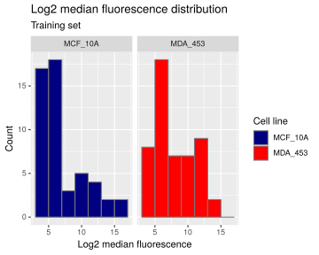<!-- -->

```r
knitr::kable(table(dat_test$cell_line), col.names = c("cell_line","number of promoters"))
```


cell_line    number of promoters
----------  --------------------
MCF_10A                       30
MDA_453                       30

```r
ggplot(dat_test, aes(x=log2_median_fluorescence, fill=as.factor(cell_line)))+
  scale_fill_manual(values = c("MDA_453"="red","MCF_10A"="navyblue"), guide=guide_legend(title="Cell line"))+
  geom_histogram(color="#777777",bins=8)+
  facet_grid(~cell_line)+
  ggtitle("Log2 median fluorescence distribution", subtitle = "Test set")+
  xlab("Log2 median fluorescence")+ylab("Count")+ylim(0,10)+xlim(3,17)+theme_gray()
```

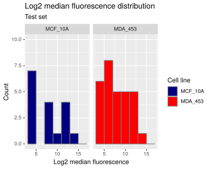<!-- -->

### Model training
We train each model with a 5 fold CV.
In the paper we also performed parameter tuning (commented out).

For brevity, only linear regression, glmnet with interaction terms and SVM with linear kernal are shown

For each model we first apply center ($X_i-\bar{X}$) and scale ($\frac{X_i}{SD(X)}$)

```r
fitControl <- trainControl(method = "repeatedcv", #5 times 5-fold CV
                           number = 5,
                           repeats = 5,
                           preProcOptions = c("center","scale"))

#lm
fit_lm <- train(form=log2_median_fluorescence~., data = dat_train[,-c(1:2)],
                  method="lm",
                  trControl = fitControl)

#glmnet with all interaction terms
# glmnet_grid <-expand.grid(alpha = seq(0,1,0.05),
#                           lambda=c(0.07,0.3,0.6,1,1.3,1.5))

fit_glmnet_inter <- train(form=log2_median_fluorescence~.*.+., #notice the interaction terms
                          data = dat_train[,-c(1:2)],
                    method="glmnet",
                    # tuneGrid=glmnet_grid,
                    trControl = fitControl)

#svmLin
fit_svmLin <- train(form=log2_median_fluorescence~., data = dat_train[,-c(1:2)],
                    method="svmLinear",
                    trControl = fitControl)
```


```r
set.seed(42)
resamps <- resamples(list(LM = fit_lm,
                          GLMNET_inter = fit_glmnet_inter,
                          SVMlin = fit_svmLin))
summary(resamps)
```

```
## 
## Call:
## summary.resamples(object = resamps)
## 
## Models: LM, GLMNET_inter, SVMlin 
## Number of resamples: 25 
## 
## MAE 
##                   Min.  1st Qu.   Median     Mean  3rd Qu.     Max. NA's
## LM           0.9761536 1.410596 1.704212 1.648319 1.813833 2.648655    0
## GLMNET_inter 0.7076308 1.196860 1.354160 1.342350 1.491425 1.747097    0
## SVMlin       1.1575152 1.432452 1.574898 1.573973 1.652544 2.226293    0
## 
## RMSE 
##                   Min.  1st Qu.   Median     Mean  3rd Qu.     Max. NA's
## LM           1.3303592 1.815186 2.145600 2.157308 2.416653 3.462276    0
## GLMNET_inter 0.8395892 1.570507 1.871588 1.748921 1.960589 2.180009    0
## SVMlin       1.4707740 1.834153 2.059760 2.038958 2.175251 2.849834    0
## 
## Rsquared 
##                   Min.   1st Qu.    Median      Mean   3rd Qu.      Max.
## LM           0.1332126 0.4969089 0.6161036 0.6004154 0.7039668 0.8530874
## GLMNET_inter 0.4169576 0.5726272 0.7150214 0.6762771 0.7737958 0.9441876
## SVMlin       0.2911026 0.5356694 0.6366266 0.5971263 0.6927542 0.8082066
##              NA's
## LM              0
## GLMNET_inter    0
## SVMlin          0
```

```r
dotplot(resamps, 
        scales = list(relation = "free"))
```

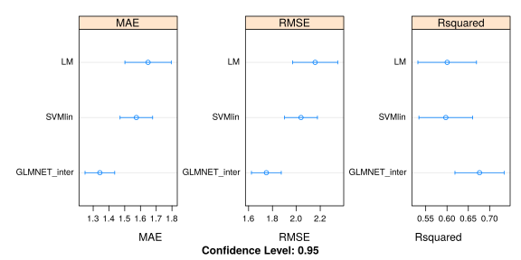<!-- -->

##Performance evaluation
This corresponds to figure S4

### Train set


```r
scatter_predict <- function(model, data, title, cell_line=F)
{
  pred <- predict(model, newdata = data[,-c(1:3)])
  tmp<-cbind(data, pred=pred)
  
  ind_MDA=which(tmp$cell_line=="MDA_453")
  r <- cor(tmp$log2_median_fluorescence, tmp$pred)^2
  min_fluor <- min(c(tmp$log2_median_fluorescence, tmp$pred))
  max_fluor <- max(c(tmp$log2_median_fluorescence, tmp$pred))
  tmp$cell_line <- factor(tmp$cell_line, labels = c("MCF-10A","MDA-MB-453"))
  
  a<- ggplot(tmp, aes(y=pred, x=log2_median_fluorescence,color=cell_line, 
                      text=paste("plasmid:",Plasmid,"\n","consensus:", consensus)))+
    geom_abline(slope = 1, color="black",size=1, alpha=0.1, linetype="F1")+
    geom_point(alpha=0.8)+
    xlim(c(3.5,17))+ylim(c(3.5,17))+
    scale_color_manual(values = c("MDA-MB-453"="red","MCF-10A"="navyblue"), 
                       guide=guide_legend(title="Cell line"), labels=c("MCF-10A","MDA-MB-453"))+
    ylab("Predicted log2 median fluorescence")+
    xlab("Real log2 median fluorescence")+
    labs(title=bquote(atop(paste("Prediction of ",.(title)),paste("Total ",R^2," = ",.(round(r,3))))))+
    theme_light()
  return(a)
}
#GLMnet inter----
scatter_predict(fit_glmnet_inter, dat_train, "GLMnet with interaction terms on training set")
```

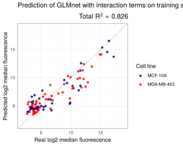<!-- -->

```r
#SVM - Lin----
scatter_predict(fit_svmLin, dat_train, "SVMLin on training set")
```

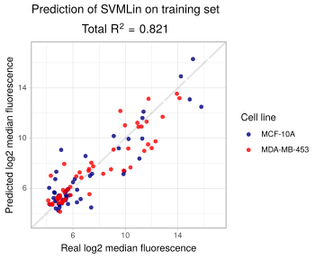<!-- -->

```r
#LM----
scatter_predict(fit_lm, dat_train, "Linear Regression on training set")
```

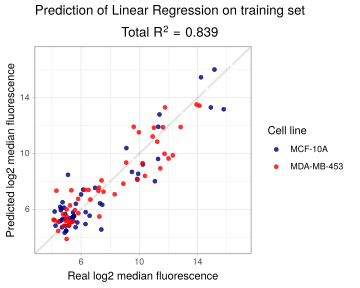<!-- -->

### Test set

```r
#GLMnet inter----
scatter_predict(fit_glmnet_inter, dat_test, "GLMnet with interaction terms on test set")
```

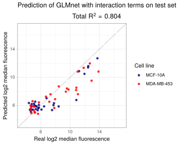<!-- -->

```r
#SVM - Lin----
scatter_predict(fit_svmLin, dat_test, "SVMLin on test set")
```

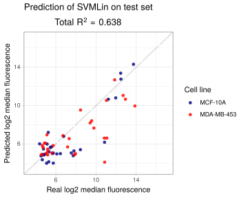<!-- -->

```r
#LM----
scatter_predict(fit_lm, dat_test, "Linear Regression on test set")
```

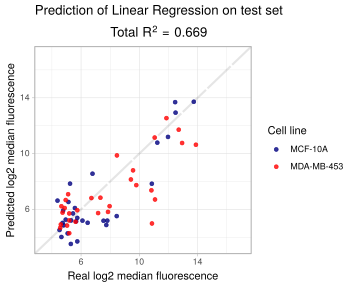<!-- -->

### Validation set

```r
#GLMnet inter----
scatter_predict(fit_glmnet_inter, val, "GLMnet with interaction terms on validation set")
```

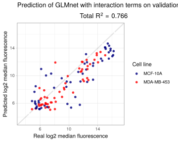<!-- -->

```r
#SVM - Lin----
scatter_predict(fit_svmLin, val, "SVMLin on validation set")
```

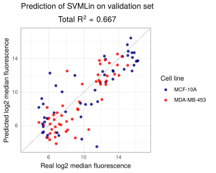<!-- -->

```r
#LM----
scatter_predict(fit_lm, val, "Linear Regression on validation set")
```

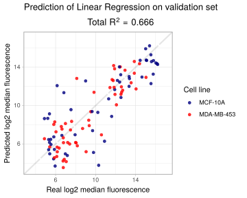<!-- -->

## Together with the validation set
In the paper, figure 3b and S5:


```r
dat <- rbind(dat,val)

#Partition----
set.seed(42)
ind_MDA <- which(dat$cell_line=="MDA_453")
dat_MDA <- dat[ind_MDA,]
n_groups=6
trainIndex_MDA <- createDataPartition(dat_MDA$log2_median_fluorescence, p = .60, 
                                      groups=n_groups,
                                      list = FALSE, 
                                      times = 1)
dat_10A <- dat[-ind_MDA,]
trainIndex_10A <- createDataPartition(dat_10A$log2_median_fluorescence, p = .60, 
                                      groups=n_groups,
                                      list = FALSE, 
                                      times = 1)

dat_train <- bind_rows(dat_10A[trainIndex_10A,], dat_MDA[trainIndex_MDA,])
dat_test <- bind_rows(dat_10A[-trainIndex_10A,], dat_MDA[-trainIndex_MDA,])

print(paste("standard deviation of log2 median fluoresence:",round(sqrt(var(dat$log2_median_fluorescence)),3)))
```

```
## [1] "standard deviation of log2 median fluoresence: 3.427"
```


```r
fitControl <- trainControl(method = "repeatedcv", #5 times 5-fold CV
                           number = 5,
                           repeats = 5,
                           preProcOptions = c("center","scale"))

#lm
fit_lm <- train(form=log2_median_fluorescence~., data = dat_train[,-c(1:2)],
                  method="lm",
                  trControl = fitControl)

#glmnet with all interaction terms
# glmnet_grid <-expand.grid(alpha = seq(0,1,0.05),
#                           lambda=c(0.07,0.3,0.6,1,1.3,1.5))

fit_glmnet_inter <- train(form=log2_median_fluorescence~.*.+., #notice the interaction terms
                          data = dat_train[,-c(1:2)],
                    method="glmnet",
                    # tuneGrid=glmnet_grid,
                    trControl = fitControl)

#svmLin
fit_svmLin <- train(form=log2_median_fluorescence~., data = dat_train[,-c(1:2)],
                    method="svmLinear",
                    trControl = fitControl)
```

This corresponds to figure S5

```r
set.seed(42)
resamps <- resamples(list(LM = fit_lm,
                          GLMNET_inter = fit_glmnet_inter,
                          SVMlin = fit_svmLin))
summary(resamps)
```

```
## 
## Call:
## summary.resamples(object = resamps)
## 
## Models: LM, GLMNET_inter, SVMlin 
## Number of resamples: 25 
## 
## MAE 
##                   Min.  1st Qu.   Median     Mean  3rd Qu.     Max. NA's
## LM           1.1289996 1.331314 1.547420 1.515318 1.702610 1.949664    0
## GLMNET_inter 0.9166869 1.209218 1.263454 1.298347 1.331618 1.926362    0
## SVMlin       0.9962068 1.392701 1.471500 1.459816 1.567193 1.871021    0
## 
## RMSE 
##                  Min.  1st Qu.   Median     Mean  3rd Qu.     Max. NA's
## LM           1.663269 1.829422 2.028141 2.053457 2.323412 2.456738    0
## GLMNET_inter 1.171967 1.531744 1.624479 1.651341 1.768874 2.341973    0
## SVMlin       1.179153 1.869398 1.967119 1.959841 2.094521 2.599130    0
## 
## Rsquared 
##                   Min.   1st Qu.    Median      Mean   3rd Qu.      Max.
## LM           0.3941958 0.6071658 0.6762641 0.6668406 0.7431908 0.8125346
## GLMNET_inter 0.5231039 0.7664769 0.7840392 0.7752710 0.8174214 0.9085549
## SVMlin       0.4941708 0.6520196 0.6873628 0.6986178 0.7366669 0.8760190
##              NA's
## LM              0
## GLMNET_inter    0
## SVMlin          0
```

```r
dotplot(resamps, 
        scales = list(relation = "free"))
```

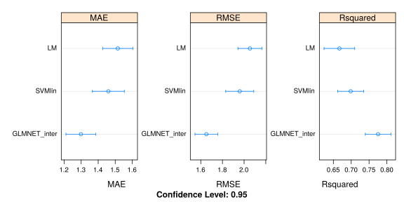<!-- -->

##Performance evaluation

This corresponds to figure 3b
### Train set


```r
#GLMnet inter----
scatter_predict(fit_glmnet_inter, dat_train, "GLMnet with interaction terms on training set")
```

<!-- -->

```r
#SVM - Lin----
scatter_predict(fit_svmLin, dat_train, "SVMLin on training set")
```

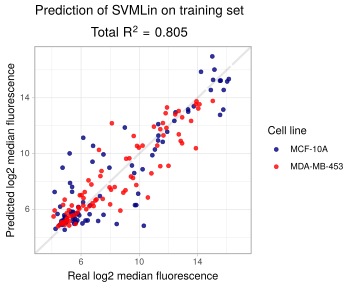<!-- -->

```r
#LM----
scatter_predict(fit_lm, dat_train, "Linear Regression on training set")
```

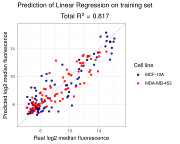<!-- -->

### Test set

```r
#GLMnet inter----
scatter_predict(fit_glmnet_inter, dat_test, "GLMnet with interaction terms on test set")
```

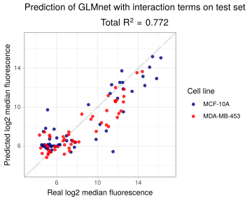<!-- -->

```r
#SVM - Lin----
scatter_predict(fit_svmLin, dat_test, "SVMLin on test set")
```

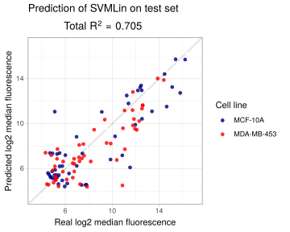<!-- -->

```r
#LM----
scatter_predict(fit_lm, dat_test, "Linear Regression on test set")
```

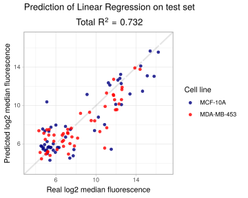<!-- -->


```r
sessionInfo()
```

```
## R version 3.5.2 (2018-12-20)
## Platform: x86_64-pc-linux-gnu (64-bit)
## Running under: Ubuntu 18.04.2 LTS
## 
## Matrix products: default
## BLAS: /usr/lib/x86_64-linux-gnu/blas/libblas.so.3.7.1
## LAPACK: /usr/lib/x86_64-linux-gnu/lapack/liblapack.so.3.7.1
## 
## locale:
##  [1] LC_CTYPE=en_IL.UTF-8       LC_NUMERIC=C              
##  [3] LC_TIME=en_IL.UTF-8        LC_COLLATE=en_IL.UTF-8    
##  [5] LC_MONETARY=en_IL.UTF-8    LC_MESSAGES=en_IL.UTF-8   
##  [7] LC_PAPER=en_IL.UTF-8       LC_NAME=C                 
##  [9] LC_ADDRESS=C               LC_TELEPHONE=C            
## [11] LC_MEASUREMENT=en_IL.UTF-8 LC_IDENTIFICATION=C       
## 
## attached base packages:
## [1] parallel  stats     graphics  grDevices utils     datasets  methods  
## [8] base     
## 
## other attached packages:
##  [1] forcats_0.4.0     stringr_1.4.0     dplyr_0.8.0.1    
##  [4] purrr_0.3.1       readr_1.3.1       tidyr_0.8.3      
##  [7] tibble_2.0.1      tidyverse_1.2.1   data.table_1.12.0
## [10] reshape2_1.4.3    doMC_1.3.5        iterators_1.0.10 
## [13] foreach_1.4.4     cowplot_0.9.4     caret_6.0-81     
## [16] ggplot2_3.1.0     lattice_0.20-38   flowCore_1.48.1  
## 
## loaded via a namespace (and not attached):
##  [1] Biobase_2.42.0      httr_1.4.0          jsonlite_1.6       
##  [4] splines_3.5.2       prodlim_2018.04.18  modelr_0.1.4       
##  [7] assertthat_0.2.0    highr_0.7           stats4_3.5.2       
## [10] cellranger_1.1.0    yaml_2.2.0          robustbase_0.93-3  
## [13] ipred_0.9-8         pillar_1.3.1        backports_1.1.3    
## [16] glue_1.3.0          digest_0.6.18       rvest_0.3.2        
## [19] colorspace_1.4-0    recipes_0.1.4       htmltools_0.3.6    
## [22] Matrix_1.2-15       plyr_1.8.4          pcaPP_1.9-73       
## [25] timeDate_3043.102   pkgconfig_2.0.2     broom_0.5.1        
## [28] haven_2.1.0         corpcor_1.6.9       mvtnorm_1.0-10     
## [31] scales_1.0.0        gower_0.2.0         lava_1.6.5         
## [34] generics_0.0.2      withr_2.1.2         nnet_7.3-12        
## [37] BiocGenerics_0.28.0 lazyeval_0.2.1      cli_1.0.1          
## [40] survival_2.43-3     magrittr_1.5        crayon_1.3.4       
## [43] readxl_1.3.0        evaluate_0.13       nlme_3.1-137       
## [46] MASS_7.3-51.1       xml2_1.2.0          class_7.3-15       
## [49] graph_1.60.0        tools_3.5.2         hms_0.4.2          
## [52] matrixStats_0.54.0  kernlab_0.9-27      glmnet_2.0-16      
## [55] munsell_0.5.0       cluster_2.0.7-1     compiler_3.5.2     
## [58] rlang_0.3.1         grid_3.5.2          rstudioapi_0.9.0   
## [61] labeling_0.3        rmarkdown_1.11      gtable_0.2.0       
## [64] ModelMetrics_1.2.2  codetools_0.2-16    rrcov_1.4-7        
## [67] R6_2.4.0            lubridate_1.7.4     knitr_1.22         
## [70] stringi_1.3.1       Rcpp_1.0.0          rpart_4.1-13       
## [73] DEoptimR_1.0-8      tidyselect_0.2.5    xfun_0.5
```

